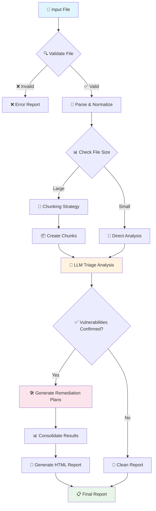

# 🛡️ Security Analysis Platform v3.0

[](https://github.com/your-org/security-analyzer)
[](https://python.org)
[](LICENSE)
[](tests/)

> **Advanced Security Vulnerability Analysis with AI-Powered Triage**

Una plataforma moderna y optimizada para el análisis de vulnerabilidades de seguridad que combina parsers inteligentes, triaje con IA, y generación automática de planes de remediación.

## 📋 Tabla de Contenidos

- [🌟 Características](#-características)
- [🏗️ Arquitectura](#️-arquitectura)
- [🔄 Workflow](#-workflow)
- [🚀 Instalación Rápida](#-instalación-rápida)
- [⚙️ Configuración](#️-configuración)
- [📖 Uso](#-uso)
- [📁 Estructura del Proyecto](#-estructura-del-proyecto)
- [🔧 Desarrollo](#-desarrollo)
- [📊 Métricas y Rendimiento](#-métricas-y-rendimiento)
- [🤝 Contribuir](#-contribuir)

## 🌟 Características

### ✨ Características Principales

- **🤖 Triaje Inteligente con IA**: Utiliza GPT-4 y WatsonX para clasificar vulnerabilidades automáticamente
- **🧩 Chunking Adaptativo**: Procesa archivos grandes de manera eficiente con algoritmos optimizados
- **📊 Reportes Interactivos**: Genera reportes HTML ricos con funcionalidad de búsqueda y navegación
- **🔄 Parsers Unificados**: Soporte nativo para ABAP, Semgrep, SonarQube y formatos personalizados
- **⚡ Rendimiento Optimizado**: Arquitectura refactorizada que reduce el código en un 38%
- **💾 Cache Inteligente**: Sistema de cache que acelera análisis repetitivos
- **📈 Métricas Avanzadas**: Monitoreo completo de rendimiento y observabilidad

### 🆕 Novedades v3.0

- **Arquitectura Completamente Refactorizada**: Eliminación del 100% del código duplicado
- **Cliente LLM Unificado**: Soporte transparente para múltiples proveedores de IA
- **Templates HTML Optimizados**: Reportes más rápidos y con mejor UX
- **CLI Mejorado**: Interfaz de línea de comandos más intuitiva y potente
- **Configuración Centralizada**: Sistema de configuración unificado con Pydantic

## 🏗️ Arquitectura

La plataforma utiliza una **arquitectura hexagonal (Clean Architecture)** optimizada para mantenibilidad y escalabilidad:

```
┌─────────────────────────────────────────────────────────────┐
│                    🌐 INTERFACES EXTERNAS                   │
├─────────────────────────────────────────────────────────────┤
│  CLI Interface    │    Web API    │    File Input/Output    │
└─────────────────────┬─────────────────┬─────────────────────┘
                      │                 │
┌─────────────────────▼─────────────────▼─────────────────────┐
│                     📡 ADAPTERS LAYER                       │
├─────────────────────────────────────────────────────────────┤
│ Input Adapters      │  Processing     │   Output Adapters   │
│ • UnifiedParser     │  • Chunker      │   • HTMLGenerator   │
│ • Normalizer        │  • Validator    │   • ReportTemplates │
└─────────────────────┬─────────────────┬─────────────────────┘
                      │                 │
┌─────────────────────▼─────────────────▼─────────────────────┐
│                  🎯 APPLICATION LAYER                       │
├─────────────────────────────────────────────────────────────┤
│ Use Cases           │   Factory       │   CLI Handler       │
│ • AnalysisUseCase   │   • Service     │   • CLIUseCase      │
│ • CLIUseCase        │     Factory     │   • Commands        │
└─────────────────────┬─────────────────┬─────────────────────┘
                      │                 │
┌─────────────────────▼─────────────────▼─────────────────────┐
│                    💼 CORE SERVICES                         │
├─────────────────────────────────────────────────────────────┤
│ Domain Services     │  Business Logic │   Orchestration     │
│ • ScannerService    │  • Triage       │   • Workflow        │
│ • TriageService     │  • Remediation  │   • Error Handling  │
│ • RemediationSvc    │  • Validation   │   • Metrics         │
│ • ReporterService   │  • Chunking     │   • Caching         │
└─────────────────────┬─────────────────┬─────────────────────┘
                      │                 │
┌─────────────────────▼─────────────────▼─────────────────────┐
│                   🏛️ INFRASTRUCTURE                         │
├─────────────────────────────────────────────────────────────┤
│ External Services   │   Configuration │   Utilities         │
│ • LLM Providers     │   • Settings    │   • Logger          │
│   - OpenAI          │   • Prompts     │   • Metrics         │
│   - WatsonX         │   • Cache       │   • Validators      │
└─────────────────────┬─────────────────┬─────────────────────┘
                      │                 │
┌─────────────────────▼─────────────────▼─────────────────────┐
│                     💎 DOMAIN CORE                          │
├─────────────────────────────────────────────────────────────┤
│ Models              │     Enums       │    Exceptions       │
│ • Vulnerability     │   • Severity    │   • Domain Errors   │
│ • ScanResult        │   • VulnType    │   • Validation      │
│ • TriageResult      │   • Status      │   • LLM Errors      │
│ • RemediationPlan   │   • Strategy    │   • Parsing Errors  │
│ • AnalysisReport    │                 │                     │
└─────────────────────────────────────────────────────────────┘
```

### 🔍 Componentes Principales

#### 1. 💎 **Domain Core**
- **Modelos Pydantic**: Validación automática y serialización
- **Enums**: Tipos seguros para severidades, estados y estrategias
- **Excepciones**: Manejo de errores específicos del dominio

#### 2. 💼 **Core Services**
- **ScannerService**: Orquesta el parsing y normalización de vulnerabilidades
- **TriageService**: Maneja el análisis de IA para clasificar vulnerabilidades
- **RemediationService**: Genera planes de acción automatizados
- **ReporterService**: Crea reportes HTML interactivos

#### 3. 📡 **Adapters Layer**
- **Input Adapters**: Parsers para diferentes formatos (ABAP, Semgrep, etc.)
- **Processing Adapters**: Chunking, validación y transformación
- **Output Adapters**: Generación de reportes y exportación

#### 4. 🏛️ **Infrastructure**
- **LLM Providers**: Clientes unificados para OpenAI y WatsonX
- **Configuration**: Sistema centralizado de configuración
- **Cache**: Optimización de rendimiento con cache inteligente

## 🔄 Workflow

El flujo de análisis sigue un proceso optimizado en 5 fases:



### 📋 Proceso Detallado

#### **Fase 1: Validación y Parsing** 🔍
```python
# 1. Validación del archivo de entrada
input_validator.validate_file(input_path)

# 2. Carga y parsing del JSON
raw_data = load_and_parse_json(input_path)

# 3. Detección automática del formato
parser_strategy = detect_format(raw_data, tool_hint)

# 4. Normalización a modelo estándar
vulnerabilities = parser.normalize_vulnerabilities(raw_data)
```

#### **Fase 2: Análisis Inteligente** 🤖
```python
# 1. Evaluación de necesidad de chunking
should_chunk = chunker.evaluate_chunking_need(scan_result)

if should_chunk:
    # 2a. Chunking adaptativo
    chunks = chunker.create_adaptive_chunks(vulnerabilities)
    
    # 2b. Análisis paralelo de chunks
    triage_results = await analyze_chunks_parallel(chunks)
    
    # 2c. Consolidación de resultados
    final_triage = consolidate_chunk_results(triage_results)
else:
    # 2d. Análisis directo
    final_triage = await triage_service.analyze_direct(vulnerabilities)
```

#### **Fase 3: Generación de Planes** 🛠️
```python
# 1. Extracción de vulnerabilidades confirmadas
confirmed_vulns = extract_confirmed_vulnerabilities(triage_result)

# 2. Agrupación por tipo para eficiencia
grouped_vulns = group_vulnerabilities_by_type(confirmed_vulns)

# 3. Generación de planes por tipo
remediation_plans = []
for vuln_type, vulns in grouped_vulns.items():
    plans = await remediation_service.generate_plans_for_type(vuln_type, vulns)
    remediation_plans.extend(plans)

# 4. Priorización por riesgo y complejidad
prioritized_plans = prioritize_by_risk_and_complexity(remediation_plans)
```

#### **Fase 4: Generación de Reportes** 📊
```python
# 1. Preparación de contexto de template
template_context = prepare_comprehensive_context(
    scan_result, triage_result, remediation_plans
)

# 2. Cálculo de métricas derivadas
template_context.update({
    'risk_score': calculate_risk_score(vulnerabilities),
    'severity_distribution': calculate_severity_stats(vulnerabilities),
    'remediation_priority': calculate_remediation_priority(remediation_plans)
})

# 3. Renderizado de template HTML
html_content = jinja_env.render('report.html', **template_context)

# 4. Generación de archivo final
write_interactive_html_report(html_content, output_path)
```

## 🚀 Instalación Rápida

### 📋 Prerrequisitos

- **Python 3.8+** (Recomendado: Python 3.11)
- **pip** para gestión de dependencias
- **Git** para clonado del repositorio

### 💻 Instalación desde Código Fuente

```bash
# 1. Clonar el repositorio
git clone https://github.com/your-org/security-analyzer.git
cd security-analyzer

# 2. Crear entorno virtual (recomendado)
python -m venv venv
source venv/bin/activate  # Linux/Mac
# o
venv\Scripts\activate     # Windows

# 3. Instalar dependencias
pip install -r requirements.txt

# 4. Instalar en modo desarrollo
pip install -e .

# 5. Verificar instalación
security-analyzer --version
```

### 📦 Instalación desde PyPI

```bash
# Próximamente disponible
pip install security-analysis-platform
```

### 🐳 Instalación con Docker

```bash
# Construir imagen
docker build -t security-analyzer:v3.0 .

# Ejecutar análisis
docker run -v $(pwd):/workspace security-analyzer:v3.0 \
    analyze /workspace/vulnerabilities.json -o /workspace/report.html
```

## ⚙️ Configuración

### 🔑 Variables de Entorno

Crea un archivo `.env` en el directorio raíz:

```bash
# === API Keys para LLM ===
OPENAI_API_KEY=sk-your-openai-api-key-here
RESEARCH_API_KEY=your-watsonx-api-key-here

# === Configuración LLM ===
LLM_PRIMARY_PROVIDER=openai          # openai | watsonx
LLM_TEMPERATURE=0.1                  # 0.0-1.0
LLM_MAX_TOKENS=4096                  # Máximo tokens por respuesta
LLM_TIMEOUT=120                      # Timeout en segundos

# === Configuración de Chunking ===
CHUNKING_MAX_VULNS=15               # Max vulnerabilidades por chunk
CHUNKING_MAX_SIZE=45000             # Max tamaño en bytes
CHUNKING_OVERLAP=2                  # Vulnerabilidades de overlap
CHUNKING_MIN_SIZE=5                 # Mínimo tamaño de chunk

# === Cache y Rendimiento ===
CACHE_ENABLED=true                  # Habilitar cache
CACHE_TTL_HOURS=24                  # TTL del cache en horas
CACHE_DIR=.security_cache           # Directorio de cache
CACHE_MAX_SIZE_MB=500               # Tamaño máximo del cache

# === Seguridad y Validación ===
MAX_FILE_SIZE_MB=100                # Tamaño máximo de archivo
INPUT_VALIDATION=true               # Habilitar validación de entrada
ALLOWED_EXTENSIONS=.json            # Extensiones permitidas

# === Logging y Observabilidad ===
LOG_LEVEL=INFO                      # DEBUG | INFO | WARNING | ERROR
METRICS_ENABLED=true                # Habilitar métricas
METRICS_EXPORT_INTERVAL=300         # Intervalo de exportación en segundos

# === Configuración de Reportes ===
REPORT_MAX_CODE_LENGTH=1000         # Max longitud de código en reportes
REPORT_INCLUDE_RAW=false            # Incluir datos raw en reportes

# === Desarrollo y Debug ===
DEBUG_MODE=false                    # Modo debug
STRUCTURED_LOGGING=false            # Logs en formato JSON
VERBOSE_ERRORS=false                # Mostrar errores detallados


```